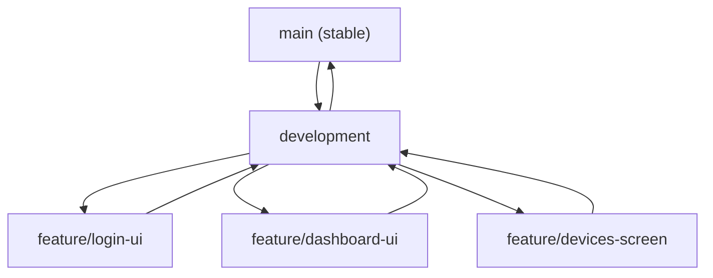

# LabNet Guardian (Frontend)

## 📱 Overview

LabNet Guardian is a mobile application designed to help university administrators monitor network activity in real-time.  
The system provides visibility into connected devices, detects suspicious behavior, and delivers alerts through a simple and modern mobile interface.

This repository contains the **Flutter frontend** of the system.

---

## 🚀 Features

- 🔐 User Authentication (Login UI scaffolded, Biometrics planned)
- 📊 Dashboard with real-time network statistics (UI scaffolded)
- 💻 Connected Devices Monitoring (IP, MAC, usage) (UI implemented)
- 🚨 Security Alerts & Notifications (UI scaffolded)
- 🕓 Activity History Tracking (UI scaffolded)
- 📈 Analytics & Reports (Planned)
- 🔎 Advanced Search (UI implemented)
- 🤖 AI Assistant (UI implemented)
- ⚙️ System Settings & Configuration (Planned)

---

## 🛠️ Tech Stack

- Flutter (Dart)
- Firebase (planned)
- Node.js (planned)
- Python (planned)

---

## 📂 Project Structure

```bash
lib/
├── main.dart
├── screens/ # Full app pages (Dashboard, Devices, Alerts, etc.)
│ ├── authentication_screen.dart
│ ├── login_screen.dart
│ ├── dashboard_screen.dart
│ ├── devices_screen.dart
│ ├── alerts_screen.dart
│ ├── history_screen.dart
│ ├── advanced_search_screen.dart
│ ├── ai_assistant_screen.dart
│ ├── analytics_screen.dart # (planned)
│ ├── settings_screen.dart # (planned)
│ ├── profile_screen.dart # (planned)
│ └── support_screen.dart # (planned)
│
├── layout/ # App layout wrappers
│ └── main_layout.dart
│
├── widgets/ # Reusable UI components
│ ├── dashboard/ # Dashboard-specific widgets
│ │ ├── dashboard_header.dart
│ │ ├── stat_card.dart
│ │ └── activity_banner.dart
│ │
│ ├── devices/ # Device-related widgets
│ │ ├── device_card.dart
│ │ └── device_filter.dart
│ │
│ ├── alerts/ # Alert-related widgets
│ │ ├── alert_card.dart
│ │ └── alert_badge.dart
│ │
│ ├── history/ # History screen widgets
│ │ └── history_item.dart
│ │
│ ├── analytics/ # Analytics widgets
│ │ ├── chart_widget.dart
│ │ └── stats_card.dart
│ │
│ ├── settings/ # Settings screen widgets
│ │ └── settings_tile.dart
│ │
│ └── common/ # Shared widgets across the app
│ ├── custom_button.dart
│ ├── custom_text_field.dart
│ ├── loading_indicator.dart
│ ├── app_drawer.dart
│ └── bottom_nav_bar.dart
│
├── models/ # Data classes (Device, Alert, User, etc.)
│ ├── device.dart
│ ├── alert.dart
│ ├── user.dart
│ └── history.dart
│
├── services/ # Business logic & mock data (for now)
│ ├── device_service.dart
│ ├── alert_service.dart
│ ├── auth_service.dart
│ └── analytics_service.dart
│
├── utils/ # Helpers, constants, and styling
│ ├── colors.dart
│ ├── constants.dart
│ └── helpers.dart
```

---

## ▶️ Getting Started

### Prerequisites

Make sure you have the following installed:

- Flutter SDK (3.x or later)
- Android Studio or VS Code
- An emulator or physical device

Check Flutter installation:
flutter --version

---

### 1. Clone the repository

git clone https://github.com/mphephuSamuel/labnet-guardian.git  
cd labnet-guardian-frontend

---

### 2. Install dependencies

flutter pub get

---

### 3. Run the app

flutter run

Or use the Windows helper script to start the backend and launch the app together:

```powershell
.\run-full-setup.ps1
```

---

### 4. Build APK (optional)

flutter build apk

---

## 🤝 Collaboration Guide

We follow a simple Git workflow to work as a team.

### Branches

- main → stable version of the app
- development → active development branch

---

### How to work on a feature

1. Pull the latest changes
   git checkout development  
   git pull

2. Create a new branch for your feature  
   Example:
   git checkout -b feature/login-ui

(Use names like: feature/dashboard-ui, feature/devices-screen)

3. Work on your feature and commit changes
   git add .  
   git commit -m "feat: add login UI"

4. Push your branch to GitHub
   git push origin feature/login-ui

5. Create a Pull Request (PR) on GitHub

- Go to the repository
- Click "Compare & pull request"
- Select base: development
- Request review

6. After merge

- Go back to development
  git checkout development  
  git pull

---

### Important Rules

- Do NOT push directly to main
- Do NOT push directly to development
- Always create a feature branch
- Always pull latest changes before starting
- Use clear commit messages (feat:, fix:, etc.)

---

## 🔄 Git Workflow Diagram



## 📸 Screens

Screens will be added here (Dashboard, Devices, Alerts, etc.)

---

## 🔧 Current Status

- ✅ App structure and global layout (Custom App Bar, Drawer, Bottom Nav) implemented
- ✅ Login and Authentication flow scaffolded (Standalone screens)
- ✅ Connected Devices, Advanced Search, and AI Assistant UI completed
- ⏳ Further UI development in progress (Dashboard, Alerts, History)
- ⏳ Using mock data (no backend yet)
- ⏳ Backend & Firebase integration coming next

---

## 👥 Team

- Tshifhiwa Mphephu – Project Lead & Backend Developer
- Jabulile Lubisi – Frontend Lead (UI/UX)
- Sibekezelo Khumalo – Security & Anomaly Engineer
- Luyanda Kubheka – QA & Documentation
- Blessing Masuku – Integration & QA

---

## 📄 License

This project is developed for academic purposes at the University of Mpumalanga.

---

## 💡 Future Improvements

- Firebase Authentication & Notifications
- Real-time data integration
- Backend API connection
- Advanced anomaly detection visualization
- Performance optimization

---

## ⭐ Notes

This project is part of the BICT421 Mini Project (LabNet Guardian) and demonstrates practical implementation of network monitoring and security concepts.
